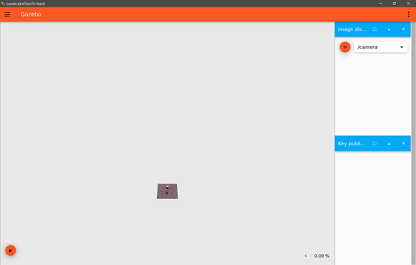

# Ground Texture Simulation
This package provides an Ignition simulation of realistic ground texture for use by monocular SLAM applications. To
promote fidelity, it uses physics based rendering (PBR) to accurately simulate the appearance of the ground texture.
Additionally, it avoids the repetition of tiles common in most simulated floors.

## Installing ##
There are two ways to use this. The code comes with a Dockerfile. If you build that, it has all the dependencies that
you need. Alternatively, you can use this directly on your computer. As of now, it only supports Ubuntu Bionic or Focal.
This is because the simulation uses Ignition Gazebo, which only works on those OS versions at the moment. Specifically,
this has been tested with Ignition Edifice. You will need the below dependencies. Most are just to support compilation.

* cmake *(installed via apt)*
* build-essential *(installed via apt)*
* git *(installed via apt)*
* wget *(installed via apt)*
* ignition edifice *(see [their documentation](https://www.ignitionrobotics.org/docs/edifice/install_ubuntu) for install
instructions)*

After installing the dependencies, run the following commands from wherever you want to put the source code.
```bash
git clone https://github.com/kylerobots/ground-texture-sim.git
mkdir ground-texture-sim/build
cd ground-texture-sim/build
cmake ..
make -j
```

## Running ##
The following commands start different parts of the simulation. They can be run in the Docker container or on your
computer, depending on the install method you used above.

### Simulation ###
To start the Gazebo simulation, run this from the root level of the code:
```bash
ign gazebo world/world.sdf
```
You should see the GUI appear with a camera feed, like so.


### Keyboard Controller ###
To start the keyboard control of the camera, run this from the build directory:
```bash
./keyboard_controller
```
There won't be anything printed on the terminal. You can then go to the GUI and press any of the keys listed on the
table to get the corresponding velocities. A key press will set the listed velocity for 0.5 seconds. After which, it
will return to 0 if no other key has been pressed. You can also hold a key down to maintain the given velocity. You
can also press multiple keys in succession to get a more complex velocity. However, holding multiple keys is
unsupported (by the keyboards, not this software).

| Key | X (m/s) | Y (m/s) | Theta (rad/s) |
| --- | ------- | ------- | ------------- |
| A   | 0.0     | -0.5    | 0.0           |
| S   | -0.5    | 0.0     | 0.0           |
| W   | 0.5     | 0.0     | 0.0           |
| D   | 0.0     | 0.5     | 0.0           |
| Q   | 0.0     | 0.0     | 0.25          |
| E   | 0.0     | 0.0     | -0.25         |